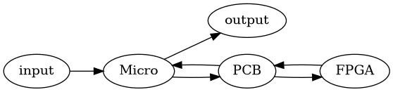
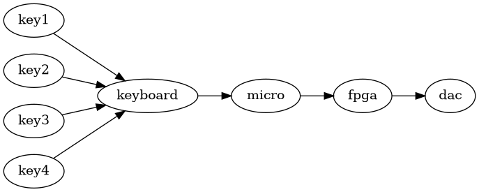
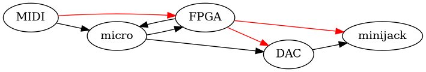

# Folk

## Amund

  - 4 året data
  - digdat, maskinnær, komptek
  - java

## Rikke

  - litt erfaring med lowlevel embedded
  - litt scala, c , asm

## Eilif

  - 3.  året data

  - hatt digdat

  - maskinnær

  - c++

  - python

## Petter

  - informatikk 4,
  - Går database
  - datadig, mikrokontrollere
  - c java c\#

## Peder

  - 4.  data

  - python, c++, c, jobbet på ARM

  - har fiklet med lyd

## Robert

  - 4.  data

  - komptekt, maskinnær

  - scala i jobb

## Rikard

  - 4.  data

  - komptekt, digdat, etc

  - python, litt c

## Karl

  - 4’de året data
  - security
  - c++ python, liker ikke scala
  - hobbyelektronikk som arduino og liknende
  - liker lodding

# oversikt

## PCB

  - printed circuit board
  - kicad
  - designes først
  - trenger ikke *mye* funksjonalitet

Vi må interagere mellom konmponentene. For dette er PCB bread and butter

## FPGA

  - field programmable gate array
  - chisel
  - arbitrær logikk

## Mikronontrolleren

  - Kraftig
  - gecko
  - ingen os
  - kjører i C eller ASM nivå
  - vanskelig med parallelle jobber grunnet mangel av os
  - inget filsystem

## Input

  - MIDI?
      - standard for å formidle noter og instrument data

## Output

  - Analog signal
  - Vi burde kjøpe en DAC

## Lydbølger

  - Polytonekrav
  - bølger kan adderes

## Amund vil at alle er enige om hva MVP er

  - 4-7 knapper
  - addering av bølger på fpga
  - kansje treig og teit

Folk samtykker i stillhet

Amund vil at alle bidrar likt, men er klar over at noen aspirerende
genier vil gjøre mere.

## Forventinger

Tegnet av Amund:

  - Vi trenger trolig en DAC, eller vi kan går får å gjøre PWM på FPGA
    hvis vi vil ha det morsomt
  - Mikrokontrolleren har 32 registere.
  - Vi trenger kansje RAM, ikke ROM
      - Dette følger med enkelte modeller av EFM-32
      - vi må bestemme hvilke komponenter vi vil ha
      - giant gecko har 1000kb mer flash memory og 128kb med RAM

### Thought process:

### Actual:

red edge: backup on PCB in case of pivot

## Kommunikasjon

Slack, Github Org

*(plz install the Slack app)*

### Lederrolle

  - Tar imot meldinger fra folk
  - Snakke med professor
  - Ta imot og gi kjeft

Hvem er den heldige: **AMUND**

## Gruppekontrakt

  - Straff for å ikke dukke opp og ikke gi grunn på standup: kakestraff
      - hjemmelaget
  - annen/mer straff kan eventuelt introduseres etter behov
  - Akademisk kvarter
  - møte onsdag kl 16-18
  - Avgjørelser: konsensus etterfulgt av avstemning ved behov (majority
    rule)
